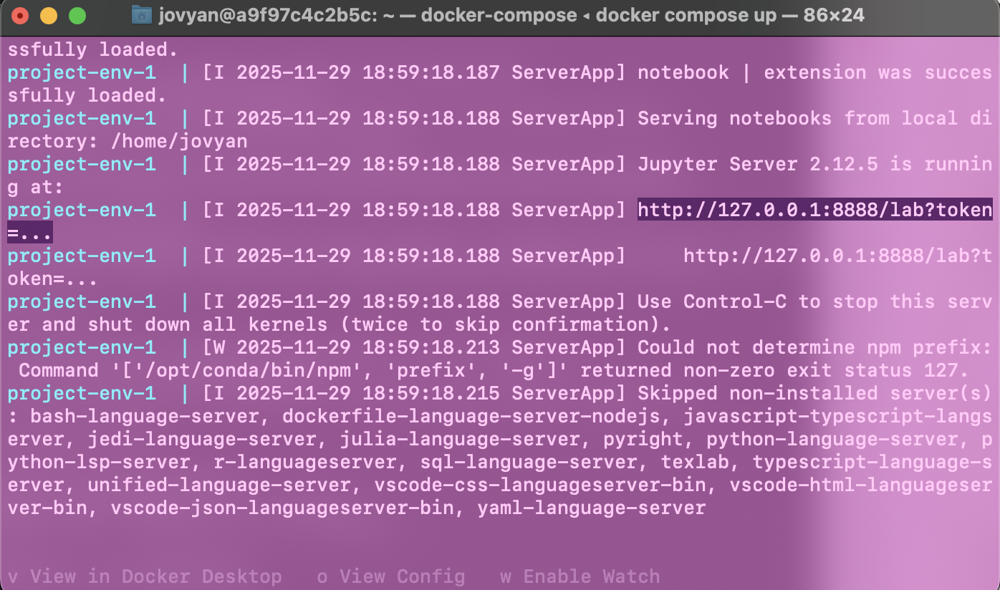

# Term Deposit Classification Project 

 - Authors: Godsgift Braimah, Devon Vorster, Chikire Aku-Ibe, & Fu Hung Kwong

This Project Demonstrates the analysis and requirements of `Milestone 1` and `Milestone 2` for the Data Science Workflows Course (DSCI 522) in the Master of Data Science program at the University of British Columbia, Vancouver.


## Project Overview
This project focuses on building a classification model to predict whether a bank client will subscribe to a term deposit; a type of investment where customers of a bank agree to lock away a specific amount of money with the bank for a fixed period of time. By analyzing client demographics (such as job type, age, education level etc.) alongside marketing interaction history, we aim to identify high-potential customers to optimize direct marketing campaigns or streamline customer relations interactions.

For our analysis we evaluated a Logistic Regression model and a Support Vector Classifier (SVC) model. We preoceeded with the SVC model as it showed better performance. The model performed well initially, achieving a test accuracy score of 0.9075 and a training score of 0.9490625. However, the dataset is heavily imbalanced, favouring clients not subscribing to term deposits, and accuracy alone was not a suitable metric. Further testing acheived a recall score of 0.24, and an f1 score of 0.32 - both of which indicate suboptimal model performance.

Given our goal is to increase the subscription rate, the model's primary goal is to minimize the False Negative rate, avoiding the error of predicting a client will not subscribe when they would have. The current performance suggests that using this model for initial client prioritization is still insufficient for a robust marketing strategy, and further analysis of precision and recall would be necessary to optimize its practical utility.

### Dataset
The data we used was obtained from the UCI Machine Learning Repository which can be found [here](https://archive.ics.uci.edu/dataset/222/bank+marketing), specifically the Bank Marketing dataset of a Portuguese bank institution. The dataset contains various features about bank customers and whether they subscribed to a term deposit, an investment product offered by the bank which is our variable y. Each row in the dataset represents a customer and our data was used to predict if they would subscribe to the term deposit or not. The original dataset contains 45211 records with 16 features and one target (17 columns). For the purpose of this analysis, we sampled 4,000 records from the original dataset to speed up our EDA and model training process.


### Report
The project analysis and our conclusions can be found [here](https://github.com/dvorster/term-deposit-classifier/blob/main/term-deposit-analysis.ipynb). 


## Usage

### Setup
> For reproducing of our analysis and results, please follow these steps: <br>

1. Clone the repository to your local machine. 
```bash
    git clone https://github.com/dvorster/term-deposit-classifier.git
```
2. Navigate to the project directory.
```bash
    cd term-deposit-classifier
```

### Running the analysis

> For Windows and Mac users, ensure your Docker Desktop is running.

1. In the root directory of this project, enter the following into the command line:
```bash
    docker compose up
```
2. In the terminal, look for a URL that starts with `http://127.0.0.1:8888/lab?token=`. Copy and paste the URL into your browser. Optionally, enter `v` in the teminal to open your docker desktop, and click on the highlighted link. <br>
(See the highlighted section of the image below for an example.)


 
3. Inside the docker container open a terminal and run the following command to clean the analysis of all previous outputs and reset the project to a clean slate:

```bash
    make clean
```

4. To run the project in it's entirety, run the following command in the terminal in the root of the project directory:

```bash
    make all
```

5. Clean up: <br>
To shut down the container and clean up resources, type 'cntrl' + 'c' in the terminal where you launched the container, and then type `docker compose rm`. Press `y` to agree when prompted.

## Developer Notes

## Dependencies
- conda (version 25.7.0)
- conda-lock (Version 3.0.4)
- ipykernel (Version 7.1.0)
- Python and packages listed [here](https://github.com/dvorster/term-deposit-classifier/blob/main/environment.yml)
- [Docker](https://www.docker.com/)

### Adding a new dependency

1. Add the dependency to the `environment.yml` file on a new branch.

2. Push the changes to GitHub. A new `conda-linux64.lock` file will be made and a new docker image will be built and pushed to Docker Hub automatically. The `docker-compose.yml` file will be automatically updated with the SHA for the new container image.

3. Send a pull request to merge the changes into the `main` branch.

### Running the test suite

Follow the same `docker compose up` steps as in the run analysis section above. In the terminal in the root of the project run `pytest` to run the suite of tests. More details can be found in the README.md in the tests directory.


## Licenses
The Term Deposit Classification analysis report is licensed under the  [Attribution-NonCommercial-NoDerivatives 4.0 International (CC BY-NC-ND 4.0)](https://creativecommons.org/licenses/by-nc-nd/4.0/). If sharing, please provide attribution and link to this webpage. The software code contained within this repository is licensed under the [MIT license](https://opensource.org/license/MIT). You can find more information in our [license file](https://github.com/dvorster/term-deposit-classifier/blob/main/LICENSE).

## References
Moro, S., Rita, P., & Cortez, P. (2014). Bank Marketing [Dataset]. UCI Machine Learning Repository. https://doi.org/10.24432/C5K306.

Scikit-learn. (n.d.). scikit-learn: Machine learning in Python. Retrieved November 21, 2025, from https://scikit-learn.org/stable/

uci-ml-repo (2025). ucimlrepo: Python package for dataset imports from the UCI Machine Learning Repository [Computer software]. GitHub. https://github.com/uci-ml-repo/ucimlrepo

Timbers, T. (n.d.). breast_cancer_predictor (Version 0.0.1) [Computer software]. GitHub: https://github.com/ttimbers/breast_cancer_predictor/tree/0.0.1

Nguhe. (n.d.). Predictive analysis of client subscription rates in the Portuguese banking sector using SAS. [Medium.](https://medium.com/@nguhe/predictive-analysis-of-client-subscription-rates-in-the-portuguese-banking-sector-using-sas-40fb04a9dcd3)

## Acknowledgements
We would like to acknowledge the support and guidance of our instructor `Sky Sheng` throughout this project. Her insight and guidance were invaluable in shaping the final outcome.
